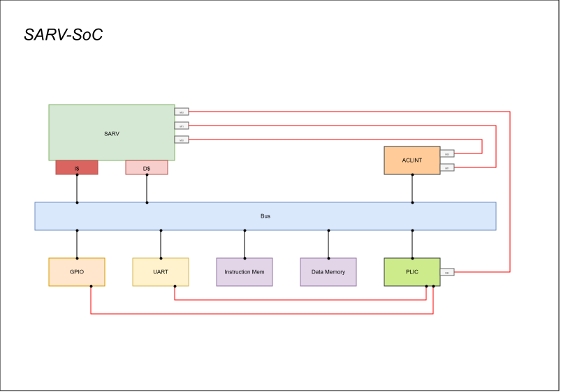

# SARV SoC

SARV-SoC is an open source RISC-V based System-on-Chip built around the **SARV** processor core. It integrates the processor with instruction and data caches, memory, interrupts, timers, and basic peripheral interfaces into a modular SoC.


<p align="center">
  
</p>

## Features

- 32-bit RISC-V processor based on the SARV core
- Modular IP-based architecture
- Instruction and data caches
- ACLINT for machine software interrupts and timer functionality
- PLIC for external interrupt management
- UART peripheral
- GPIO peripheral
- Instruction and data memory
- Simulation testbench


## Getting the Source

Clone the repository together with all IP submodules:

```bash
git clone --recursive git@github.com:Sarst04/SARV-SoC.git
cd SARV-SoC
```

If the repository has already been cloned without submodules:

```bash
git submodule update --init --recursive
```

Check the submodule status with:

```bash
git submodule status
```

## RTL Extraction

The project provides a Makefile for extracting a standalone RTL tree.

Run:

```bash
make rtl
```

The generated RTL is placed int out folder.

